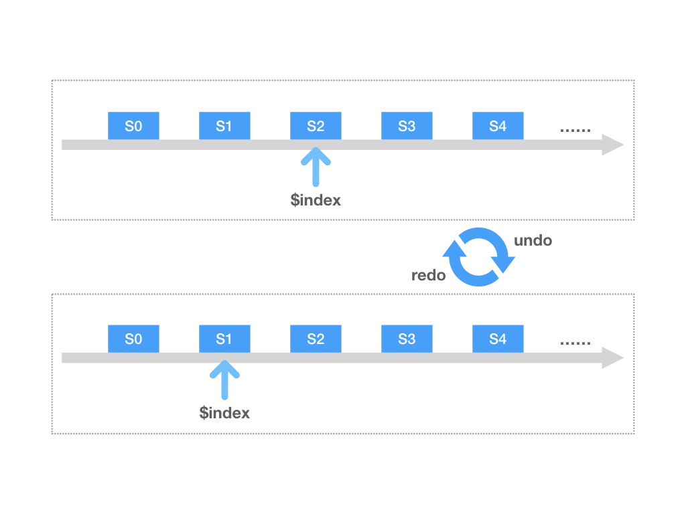
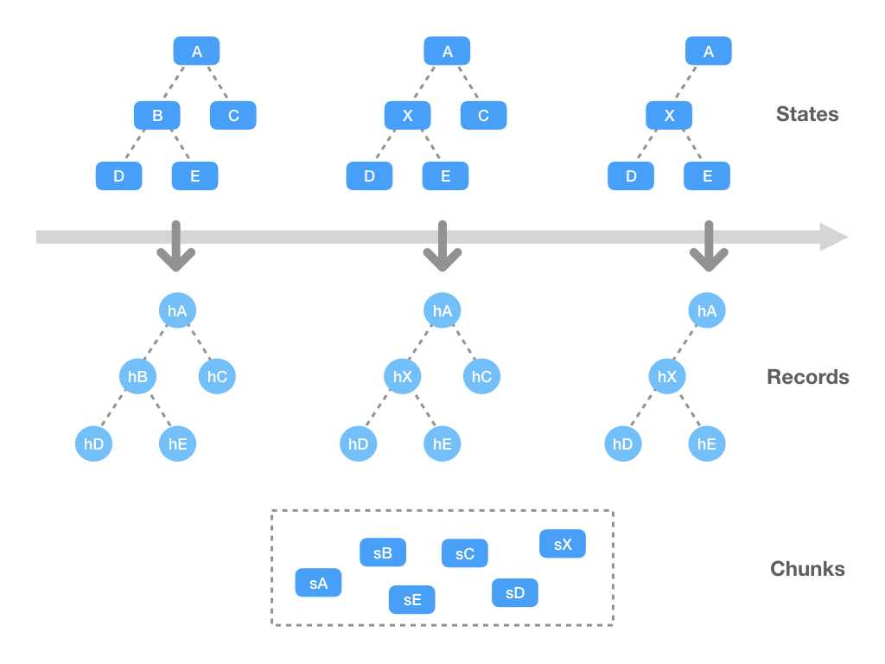
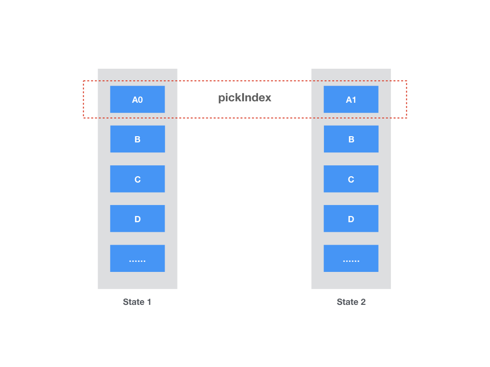

# state-snapshot

[![npm version][npm-version-src]][npm-version-href]
[![npm downloads][npm-downloads-src]][npm-downloads-href]
[![bundle][bundle-src]][bundle-href]
[![License][license-src]][license-href]

💾 基于结构共享的非侵入式历史状态管理。

只需将你的状态推送到 state-snapshot 中，即可实现 `undo` / `redo` 操作！

> 代码 fork 自: [StateShot](https://github.com/gaoding-inc/stateshot)

## 快速开始

通过 NPM 安装：

```bash
npm i state-snapshot
```

基本用法：

```js
import { History } from 'state-snapshot'

const state = { a: 1, b: 2 }

const history = new History()
history.pushSync(state) // history.push API 是异步的，这里使用同步版本

state.a = 2 // 修改状态！
history.pushSync(state)

history.get() // { a: 2, b: 2 }
history.undo().get() // { a: 1, b: 2 }
history.redo().get() // { a: 2, b: 2 }
```

## 核心概念
对于历史状态管理来说，最基本的需求就是 `undo` / `redo` API。这正是 state-snapshot 开箱即用提供的功能，如下图所示：



看起来很简单，对吧？但在实际项目中，保存完整状态的成本是很高的。不可变数据结构因为可以在不同引用之间共享数据结构而被认为很适合这种场景。然而，这需要完全适配不可变库 - 这确实可能比较激进。

state-snapshot 通过其简洁的 API 表面支持可共享的数据结构。核心概念是将状态节点序列化为块，计算块的哈希值，如果哈希值相同则共享相同的空间：



除了 state-snapshot 支持的灵活的基于规则的转换之外，它还为 SPA 应用提供了另一个低成本的优化。假设你的根状态由多个"页面"组成，编辑其中一个页面不会影响其他页面。在这种情况下，计算完整状态的哈希值是低效的。作为解决方案，你可以在推送新状态时简单地指定一个 `pickIndex`，告诉库要记录哪个页面：



有了这个提示，只有受影响的子节点的哈希值会被重新计算。其他子节点则与之前的记录保持相同。

## API

### `History`
`new History(options?: Options)`

状态管理的主类，选项包括：

* `initialState` - 可选的初始状态。
* `rules` - 可选的规则数组，用于优化数据转换。
* `delay` - `push` 的防抖时间（毫秒），默认为 `50`。
* `maxLength` - 保存历史状态的最大长度，默认为 `100`。
* `useChunks` - 是否将状态数据序列化为块。默认为 `true`。
* `onChange` - 在推送/拉取状态时触发，传入已更改的状态。

> 如果你想将 state-snapshot 与不可变数据一起使用，只需将 `useChunks` 设置为 `false`，状态的新引用将直接保存为记录。

#### `push`
`(state: State, pickIndex?: number) => Promise<History>`

将状态数据推送到历史记录中，内部使用 `pushSync`。`state` 不必是 JSON 可序列化的，因为你可以定义规则来解析它。

如果指定了 `pickIndex`，则只有该索引的状态子节点会被序列化。其他子节点将从之前的记录中复制。此优化仅在存在之前的记录时发生。

#### `pushSync`
`(state: State, pickIndex?: number) => History`

立即将状态推送到历史栈中。同样支持 `pickIndex`。

#### `undo`
`() => History`

如果可能，撤销一个记录，支持链式调用，例如：`undo().undo().get()`。

#### `redo`
`() => History`

如果可能，重做一个记录，同样支持链式调用。

#### `hasUndo`
`boolean`

当前状态是否有之前的撤销记录。

#### `hasRedo`
`boolean`

当前状态是否有之后的重做记录。

#### `length`
`number`

当前实例的有效记录长度。

#### `get`
`() => State`

从记录中获取历史状态。

#### `reset`
`() => History`

清除内部数据结构。

### `Rule`
`{ match: function, toRecord: function, fromRecord: function }`

通过定义规则，你可以指定如何在状态和内部"块"之间进行转换。块用于结构共享。

> 规则仅用于优化。除非你遇到性能瓶颈，否则你不必学习或使用它们。

#### `match`
`node: StateNode => boolean`

定义一个规则是否可以匹配。例如，如果你要保存具有不同 `type` 字段的 vDOM 状态，只需定义一些规则，如 `node => node.type === 'image'` 或 `node => node.type === 'text'`。

#### `toRecord`
`StateNode => { chunks: Chunks, children: Children }`

对于匹配的节点，`chunks` 是我们将其转换成的可序列化数据，而 `children` 则挑选出其子节点以供进一步遍历（默认情况下，我们遍历每个状态节点的 `children` 字段，你可以通过提供类似 `children: node.elements` 的代码来自定义此行为）。通常每个节点一个块就足够了，但你可以通过这种方式将一个节点拆分为多个块：

```js
const state = {
  type: 'container',
  children: [
    { type: 'image', left: 100, top: 100, image: 'foo' },
    { type: 'image', left: 200, top: 200, image: 'bar' },
    { type: 'image', left: 300, top: 300, image: 'baz' }
  ]
}

// 假设 `image` 是一个很大的字段，我们可以将这个字段拆分为一个块
function toRecord(node) {
  return {
    chunks: [
      { ...node, image: null },
      node.image
    ]
  }
}
```

#### `fromRecord`
`{ chunks: Chunks, children: Children } => StateNode`

将块解析回状态节点。对于之前的情况：

```js
// 从多个块中恢复状态节点
function fromRecord({ chunks, children }) {
  return {
    ...chunks[0],
    image: chunks[1]
  }
}

const rule = {
  match: ({ type }) => type === 'image',
  toRecord,
  fromRecord
}
```

## 许可证

[MIT](./LICENSE) License © 2024-PRESENT [XiaDeYu](https://github.com/Xdy1579883916)

<!-- 徽章 -->

[npm-version-src]: https://img.shields.io/npm/v/state-snapshot?style=flat&colorA=080f12&colorB=1fa669
[npm-version-href]: https://npmjs.com/package/state-snapshot
[npm-downloads-src]: https://img.shields.io/npm/dm/state-snapshot?style=flat&colorA=080f12&colorB=1fa669
[npm-downloads-href]: https://npmjs.com/package/state-snapshot
[bundle-src]: https://img.shields.io/bundlephobia/minzip/state-snapshot?style=flat&colorA=080f12&colorB=1fa669&label=minzip
[bundle-href]: https://bundlephobia.com/result?p=state-snapshot
[license-src]: https://img.shields.io/github/license/Xdy1579883916/state-snapshot.svg?style=flat&colorA=080f12&colorB=1fa669
[license-href]: https://github.com/Xdy1579883916/state-snapshot/blob/main/LICENSE
